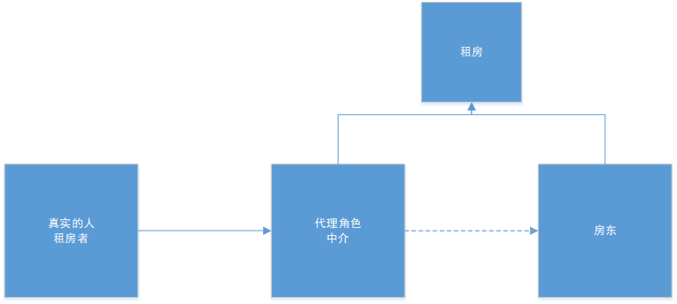
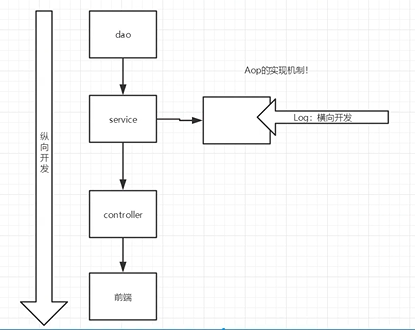
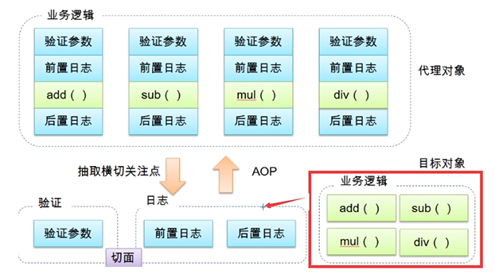
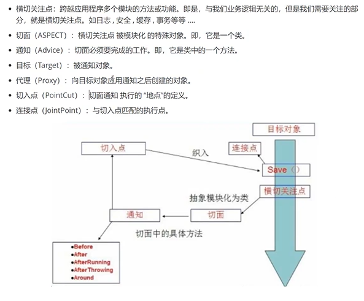
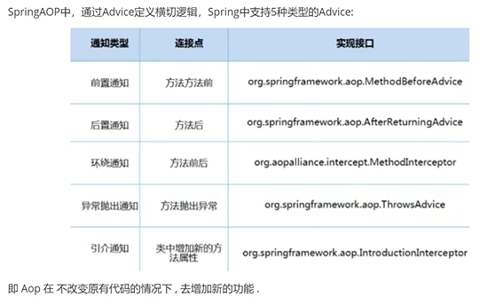

# 1、[Spring](https://www.bilibili.com/video/BV1WE411d7Dv?p=5)

## 1.1、前期准备

#### 学习[地址](https://docs.spring.io/spring-framework/docs/5.2.0.RELEASE/spring-framework-reference/core.html#spring-core)

#### 了解：

- SSH :  Struct2 + Spring + Hibernate
- SSM : SpringMvc + Spring + Mybatis

下载：[点此](https://mvnrepository.com/artifact/org.springframework/spring-webmvc)

**依赖：**

```xml
<!-- https://mvnrepository.com/artifact/org.springframework/spring-webmvc -->
<dependency>
    <groupId>org.springframework</groupId>
    <artifactId>spring-webmvc</artifactId>
    <version>5.3.4</version>
</dependency>
<!-- https://mvnrepository.com/artifact/org.springframework/spring-webmvc -->
<dependency>
    <groupId>org.springframework</groupId>
    <artifactId>spring-jdbc</artifactId>
    <version>5.3.4</version>
</dependency>

```

## 1.2、优点

- Spring是一个轻量级、非入侵式的框架
- 控制反转（IOC）,面向切面编程（AOP）
- 支持事务的处理，对框架整合的支持

> 总结一句话：Spring就是一个轻量级的控制反转（IOC）和面向切面编程（AOP）的框架

- Spring Boot

  - 一个快速开发的脚手架
  - 基于SpringBOOT可以快速开发单个微服务
  - 约定大于配置

- Spring Cloud

  - Spring Cloud是基于SpringBoot实现的

  

## 1.3、弊端

配置过多

# 2、IOC理论推导

1. UserDao接口
2. YserDaoImpl实现类
3. UserService业务接口
4. UserServiceImpl业务实现类

```java
    //用户实际调用的是业务层，dao层他们不需要接触
    UserService userService = new UserServiceImpl();

    //用户 新增需求，写在了dao层，此需要可能会影响原来的业务层代码，
    // 修改业务层service Userserviceimpl 代码为 set注入 来动态获取值
    //  之前，程序是主动创建对象，控制权在程序员手上，没新增一个就要新增dao层接口实现
    //  现在，使用了set注入，程序不再具有主动性，变成了被动的接受对象
    //从本质上解决问题，程序猿不需要去管理对象的创建
    //原本套路：扩展业务后，修改service层，但是现在只需要专注业务层
	//即控制反转
    ((UserServiceImpl)userService).setUserDao(new UserDaoMysqlImpl());
    userService.getUser();
```

```java
    //程序控制选择的对象，但是会导致后期大量修改
    //private UserDao userDao = new UserDaoImpl();
    //优化方案：
    //设置接口，用set方法进行动态实现值的注入
    private UserDao userDao ;
    public void setUserDao(UserDao userDao) {
        this.userDao = userDao;
    }

    public void getUser() {
        userDao.getUser();
    }
```


### 控制反转

即：获得依赖对象的方式反转了，程序员获得了解放，用户获得了想要的自由调度的机会

| 主动权在程序员，每增加一种需要就要修改业务层                 | 主动权在用户，增加需要后用户选择调用                         |
| ------------------------------------------------------------ | ------------------------------------------------------------ |
|  |  |


#### 控制

谁来控制对象的创建？传统应用程序的对象是由程序本身控制创建的，使用Spring后，对象是由Spring来创建的。

#### 反转

程序本身不创建对象，变成被动的接收对象

#### 依赖注入

利用set方法来进行注入

#### IOC小结

IOC是一种编程思想，由主动的编程变成被动的接收

我们彻底不用在程序中去做改动，要实现不同的操作，只需要在xml配置文件中进行注册就可以

##### 所谓的IOC

一句话：对象由Spring创建、管理、装配

#### 思考：

Hello对象的属性是怎么设置的？

答案：是由Spring容器设置的

### 底层逻辑


### IOC创建对象的方式

beans.xml容器的配置<官网>

```xml
<?xml version="1.0" encoding="UTF-8"?>
<beans xmlns="http://www.springframework.org/schema/beans"
    xmlns:xsi="http://www.w3.org/2001/XMLSchema-instance"
    xsi:schemaLocation="http://www.springframework.org/schema/beans
        https://www.springframework.org/schema/beans/spring-beans.xsd">

    <bean id="..." class="...">  
        <!-- collaborators and configuration for this bean go here -->
    </bean>

    <bean id="..." class="...">
        <!-- collaborators and configuration for this bean go here -->
    </bean>

    <!-- more bean definitions go here -->

</beans>
```

1. 使用无参构造方法创建对象

2. 假设要使用有参构造方法创建对象

   1. 下标赋值

      ```java
      <bean id="user" class="com.yuan.pojo.User">
          <constructor-arg index="0" value="下标赋值"/>
      </bean>
      ```

   2. 参数类型  不建议使用

      ```java
      <bean id="user" class="com.yuan.pojo.User">
      	<constructor-arg type="java.lang.String" value="根据参数类型"/>
      </bean>
      ```

   3. 参数名

      ```java
      <bean id="user" class="com.yuan.pojo.User">
      	<constructor-arg name="name" value="直接通过参数名"/>
      </bean>
      ```

   总结：在配置文件加载的时候，容器中管理的对象就已经初始化了

# 3、Spring配置

### 别名

```xml
    <!--别名 两个名字都可使用-->
    <alias name="test" alias="test2"/>
```

### bean的配置

```xml
    <!--
    id : bean的唯一标识符，也就是相当于我们学习的对项目
    class : bean对象所对应的权限命名：包名+类型
    name : 也是别名,而且 name 可以同时取多个别名，比alias更高级,name 可以用 空格，都好，分号 来分割
    -->
    <bean id="test" class="com.yuan.pojo.UserSecondTest" name="test2 test3,test4;test5">
        <constructor-arg name="testName" value="测试第二个实例"/>
    </bean>
```

### import

一般用于团队开发，可以将多个配置文件<bean.xml>导入合并为一个

假设，现在项目中有多个人开发，这三个人复制不通的类开发，不同的类需要注册在不通的bean中

用import将所有人的beans.xml合并为一个总的

- 张三
- 李四
- 王五
- applicationContext.xml

```xml
<?xml version="1.0" encoding="UTF-8"?>
<beans xmlns="http://www.springframework.org/schema/beans"
       xmlns:xsi="http://www.w3.org/2001/XMLSchema-instance"
       xsi:schemaLocation="http://www.springframework.org/schema/beans
        https://www.springframework.org/schema/beans/spring-beans.xsd">

    <import resource="beans.xml"/>
    <import resource="beans2.xml"/>
    <import resource="beans3.xml"/>
</beans>
```

使用的时候，直接使用总的配置就可以了

# 4、依赖注入

### 1、构造器注入

```xml
    <bean id="beanOne" class="x.y.ThingOne">
        <constructor-arg ref="beanTwo"/>
        <constructor-arg ref="beanThree"/>
    </bean>
```

### 2、Set方式注入[重点]

- 依赖注入：Set注入
  - 依赖：bean对象的创建依赖于容器
  - 注入：bean对象的所有属性，由容器来注入

#### 环境搭建：

##### 复杂类型

```java
public class Address {
    private String address;

    public String getAddress() {
        return address;
    }

    public void setAddress(String address) {
        this.address = address;
    }
}
```

##### 测试对象

```java
    //测试样例  value | ref | list | map | set  | bean | idref | props | null
    private String name;   //value
    private Address address;   //ref
    private String[] books;     //idref 数组
    private List<String> hobbys;  //list
    private Map<String,String> card;   //map
    private Set<String> games;  //set
    private String wife;        //null  空指针
    private Properties info;   //props
```

##### beans.xml

```xml
<bean id="address" class="com.yuan.pojo.Address">
    <property name="address" value="射阳"/>
</bean>

<bean id="student" class="com.yuan.pojo.Student">
    <!--第一种  普通值注入-->
    <property name="name" value="value测试"/>

    <!--第二种 bean注入 ref-->
    <property name="address" ref="address"/>

    <!--第三种 数组注入-->
    <property name="books">
        <array>
            <value>红楼梦</value>
            <value>水浒传</value>
            <value>西游记</value>
            <value>三国志</value>
        </array>
    </property>

    <!--第四种 list注入-->
    <property name="hobbys">
        <list>
            <value>听歌</value>
            <value>鞋子</value>
            <value>加班</value>
        </list>
    </property>

    <!--第五种 map注入-->
    <property name="card">
        <map>
            <entry key="身份证" value="321789199511023597"/>
            <entry key="银行卡" value="010101010101010101"/>
        </map>
    </property>

    <!--第六种 set注入-->
    <property name="games">
        <set>
            <value>国正LOL</value>
            <value>美测LOL</value>
            <value>美正LOL</value>
        </set>
    </property>

    <!--第七种 null注入-->
    <property name="wife">
        <null/>
    </property>

    <!--第八种 properties注入-->
    <property name="info">
        <props>
            <prop key="driver">12456897</prop>
            <prop key="url">男</prop>
            <prop key="username">yuan</prop>
            <prop key="password">lei</prop>
        </props>
    </property>
</bean>
```

##### 测试类

```java
    public static void main(String[] args){
        ApplicationContext context = new ClassPathXmlApplicationContext("beans.xml");
        Student student = (Student) context.getBean("student");
        System.out.println(student.getName());
    }
```


### 3、拓展方式注入[第三方]

我们可以使用[P命名与C命名空间实现注入](http://r6d.cn/b9xr9)

##### 引入头部命名空间

```xml
xmlns:p="http://www.springframework.org/schema/p"
xmlns:c="http://www.springframework.org/schema/c"
```

##### 使用

```xml
<!--P命名空间注入，可以直接注入属性的值-->
<bean id="user" class="com.yuan.pojo.User" p:name="p-yuan" p:age="25"/>

<!--
        C-命名空间注入，通过构造器注入
        相比P命名，需要有参 与 无参方法
    -->
<bean id="user2" class="com.yuan.pojo.User" c:name="c-yuan" c:age="25" />
```

##### 测试

```java
@Test
public void test2(){
    ApplicationContext context = new ClassPathXmlApplicationContext("userbeans.xml");

    User user = context.getBean("user", User.class);
    User user2 = context.getBean("user2", User.class);
    System.out.println("P命名注入："+user.toString()+"  C命名："+user2.toString());
}
```

注意点：P命名与C命名空间不能直接使用，需要导入约束，即命名空间头部

#### 4、bean的作用域

| Scope                                                        | Description                                                  |
| ------------------------------------------------------------ | ------------------------------------------------------------ |
| [singleton](https://docs.spring.io/spring-framework/docs/5.2.0.RELEASE/spring-framework-reference/core.html#beans-factory-scopes-singleton) | (Default) Scopes a single bean definition to a single object instance for each Spring IoC container. |
| [prototype](https://docs.spring.io/spring-framework/docs/5.2.0.RELEASE/spring-framework-reference/core.html#beans-factory-scopes-prototype) | Scopes a single bean definition to any number of object instances. |
| [request](https://docs.spring.io/spring-framework/docs/5.2.0.RELEASE/spring-framework-reference/core.html#beans-factory-scopes-request) | Scopes a single bean definition to the lifecycle of a single HTTP request. That is, each HTTP request has its own instance of a bean created off the back of a single bean definition. Only valid in the context of a web-aware Spring `ApplicationContext`. |
| [session](https://docs.spring.io/spring-framework/docs/5.2.0.RELEASE/spring-framework-reference/core.html#beans-factory-scopes-session) | Scopes a single bean definition to the lifecycle of an HTTP `Session`. Only valid in the context of a web-aware Spring `ApplicationContext`. |
| [application](https://docs.spring.io/spring-framework/docs/5.2.0.RELEASE/spring-framework-reference/core.html#beans-factory-scopes-application) | Scopes a single bean definition to the lifecycle of a `ServletContext`. Only valid in the context of a web-aware Spring `ApplicationContext`. |
| [websocket](https://docs.spring.io/spring-framework/docs/5.2.0.RELEASE/spring-framework-reference/web.html#websocket-stomp-websocket-scope) | Scopes a single bean definition to the lifecycle of a `WebSocket`. Only valid in the context of a web-aware Spring `ApplicationContext`. |

1、单例模式 singleton（spring默认机制）共用实例

```xml
<bean id="user2" class="com.yuan.pojo.User" c:name="c-yuan" c:age="25" scope="singleton"/>
```

2、原型模式 prototype 每次都新建实例

```xml
<bean id="user2-2" class="com.yuan.pojo.User" c:name="c-yuan" c:age="25" scope="prototype"/>
```

3、其余的的只能在web开发中使用到

# 5、Bean的自动装配

- 自动装配是Spring满足bean依赖的一种方式
- Spring会再上下文中自动寻找，自动给bean装配属性

### 在Spring中有三种装配方式

1. 在xml中显示的配置
2. 在java中显示配置
3. 隐式的自动装配bean【重要】

## 5.1、测试

1、环境搭建

- 人
- 狗
- 猫

### 5.2、byName 与 byType 自

```xml
<!--
        byName : 会自动在容器上下文中查找，和自己对象set方法后面的值对应的beanid
        byType : 会自动在容器上下文中查找，和自己对象属性类型相同的bean  注入的bean 中的id 都是可以省略的
    -->
<bean id="people" class="com.yuan.pojo.People" autowire="byName">
    <property name="name" value="yuan"/>
    <!--不自动装配 写的代码-->
    <!--<property name="dog" ref="dog"/>-->
    <!--<property name="cat" ref="cat"/>-->
</bean>
```

小结：

- byName，需要保证所有的bean的id唯一，且这个bean需要和自动注入的属性的`set方法`的**值**一致
- byType，需要保证所有的bean的class唯一，且这个bean需要和自动注入的属性的**类型**一致

# 6、使用注解开发

jdk1.5支持注解，Spring2.5支持

The introduction of annotation-based configuration raised the question of whether this approach is “better” than XML

使用注解须知

1. 导入约束：context约束
2. ==配置注解的支持：<context:annotation-config/>==

```xml
<?xml version="1.0" encoding="UTF-8"?>
<beans xmlns="http://www.springframework.org/schema/beans"
    xmlns:xsi="http://www.w3.org/2001/XMLSchema-instance"
    xmlns:context="http://www.springframework.org/schema/context"
    xsi:schemaLocation="http://www.springframework.org/schema/beans
        https://www.springframework.org/schema/beans/spring-beans.xsd
        http://www.springframework.org/schema/context
        https://www.springframework.org/schema/context/spring-context.xsd">
    <!--开启注解的支持-->
    <context:annotation-config/>

</beans>
```

### 1、bean

#### `@Autowired`[常用]

==自动装配，通过类型，名字==

直接在属性上使用,也可以在set方式上使用

可以不用编写set方法，前提是自动装配的属性在IOC(Spring)容器中存在，且符合名字byName

附加:

```xml
@Nullable 字段标记这个注解，说明这个字段可以为NULL    
public void setCat(@Nullable Cat cat) {
   this.cat = cat;
}
```

如果显示定义了 @Autowired 的required属性为false，说明这个对象可以为null，否则不允许为空

```
@Autowired(required = false)
private Cat cat;
```

如果@Autowired自动装配环境很复杂，自动装配无法通过一个注解完成的时候，我们可以使用@Qualifier(value="xxx")去配置@Autowired的使用，指定一个唯一的bean对象注入

#### @Resource

==自动装配，通过名字、类型==

先通过名字查找，再通过实例查找，都找不到时候会报错【更高级】

#### 异同

- 都是用来自动装配，都可以放在属性字段上
- @Autowired通过byType方式实现，而且必须要求这个对象存在
- @Resource默认通过byName的方式实现，如果找不到名字，则通过byType实现！如果两个都找不到，会报错
- 执行顺序不同，@Autowaired通过byType的方式实现

#### @Component

组件，放在类上，说明这个类被Spring管理了，就是bean

### 2、属性如何注入

```java
//@Component 组件 等价于  applicationContext.xml 中<bean id="user" class="com.yuan.pojo.User"/>
@Component
public class User {
    //测试注解开发  简单的可以，复杂的还是走配置文件
    //相当于 <property name="age" value="26">
    @Value("27")
    public String age;

    //测试注解开发 set方法  优先使用 set ，后面使用定义时的对象
    @Value("26")
    public void setAge(String age) {
        this.age = age;
    }

    //对比注解开发  赋值模式
    public String name = "stan 注解开发";
}
```

### 3、衍生的注解

@Component有几个衍生注解，我们在web开发中，会按照mvc三层架构分层

- dao【@Repository】
- service【@Service】
- controller【@Controller】

以上四个注解功能是一样的，都是代表将某个类注册到Spring容器中装配

### 4、自动装配注解

```xml
@Autowired：自动装配通过类型，名字
	如果上述不能唯一自动装配上属性，则需要通过@Qualifier(value="xxx")
@Nullable：字段标识了这个注解，说明这个字段可以为null
@Resource：自动装配通过名字，类型
```

### 5、作用域

==@Scope("singleton")==

```
@Component
@Scope("singleton")
public class User {
    @Value("27")
    public String age;
}

```

### 6、小结

xml与注解：

- xml    更加万能，适用于任何场合，维护简单方便
- 注解   不是自己的类无法使用 ，维护相对复杂

xml与注解的最佳实践：

- xml   用来管理bean
- 注解   只负责完成属性的注入
- 我们在使用的过程中，只需要注意一个问题：必须让注解生效，就需要开启注解的支持

```xml
<!--指定要扫描的包，这个包下的注解就会生效-->
<context:component-scan base-package="com.yuan"/>
<!--开启注解的驱动的支持-->
<context:annotation-config/>
```

# 7、使用JAVA的方式配置Spring

我们现在要完全不使用Spring的xml配置了，全权交给java来做

javaConfig是Spring的一个子项目，再Spring4之后，它成为了一个核心功能

### 实体类

```java
//这里这个注解的作用，就是说明这个类被spring接管了，注册到了容器中
@Component
public class User {
    private String name;

    public String getName() {
        return name;
    }

    @Value("yuan")
    public void setName(String name) {
        this.name = name;
    }

    @Override
    public String toString() {
        return "User{" +
                "name='" + name + '\'' +
                '}';
    }
}
```

### 配置类

```java
package com.yuan.config;

import com.yuan.pojo.User;
import org.springframework.context.annotation.Bean;
import org.springframework.context.annotation.ComponentScan;
import org.springframework.context.annotation.Configuration;
import org.springframework.context.annotation.Import;
import org.springframework.stereotype.Component;

//@Configuration  这个也会被Spring容器托管，注册到容器中，因为它本身就是一个@Component，即组件
//@Configuration  代表这是一个配置类，就和我们之前看的beans.xml医院
@Configuration
//spring 可以完全摈弃配置  新特性
@ComponentScan("com.yuan.pojo")
@Import(yuanConfig.class)
public class yuanConfig {


    //注册一个bean，就相当于我们之前写的一个bean标签
    //这个方法的名字，就相当于bean标签中的id属性
    //这个方法的返回值，就相当于bean标签中的class属性
    @Bean
    public User getUser(){
        return new User();//就是返回要注入的bean对象
    }
}

```

### 测试类

```java
import com.yuan.config.yuanConfig;
import com.yuan.pojo.User;
import org.springframework.context.ApplicationContext;
import org.springframework.context.annotation.AnnotationConfigApplicationContext;
public class MyTest {
    public static void main(String []args){
        //如果完全使用了配置类方式去做，我们就只能通过AnnotationConfig 上下文去获取容器，通过配置类的class对象加载
        ApplicationContext context = new AnnotationConfigApplicationContext(yuanConfig.class);
        User user = context.getBean("getUser", User.class);
        System.out.println(user.toString());
    }
}
```

这种纯java的配置方式，再SpringBoot中随处可见

# 8、代理模式

为什么要学习代理模式？因为这就是SpringAOP的底层！【SpringAOP和SpringMVC】

代理模式的分类：

- 静态代理

- 动态代理



## 8.1静态代理

### 角色分析：

- 抽象角色：一般会使用接口或者抽象类类解决

- 真实角色：被代理的角色

- 代理角色：代理真实角色，代理真实角色后，我们一般会做一些附属操作

- 客户：访问代理对象的人


### 代码步骤

1. #### 接口

   ```java
   //租房 接口
   public interface Rent {
       public void rent();
   }
   ```

2. #### 真实角色

   ```java
   //房东
   public class Host {
       public void rent(){
           System.out.println("房东要出租房子");
       }
   }
   ```

3. #### 代理角色

   ```java
   //中介
   public class proxy implements Rent{
       private Host host;
       public proxy(){
   
       }
       public proxy(Host host){
           this.host = host;
       }
   
       public void rent(){
           //代理帮房东租房子
           host.rent();
       }
   
       //看房
       public void seeHouse(){
           System.out.println("中介带你看房");
       }
   
       //收中介费
       public void sign(){
           System.out.println("中介签租房合同");
       }
   
       //收中介费
       public void fare(){
           System.out.println("中介收中介费");
       }
   }
   ```

4. #### 客户端访问代理角色

   ```java
   //租房者 我
   public class Client {
       public static void main(String []args){
           //房东要租房子
           Host host = new Host();
           //直接找房东租房子  但是真实情况下一般找不到 只能找中介
           host.rent();
           //代理，中介帮房东租房子，但代理角色一般会有一些附属操作，比如中介收钱
           proxy proxy = new proxy(host);
           //你不用面对房东，直接找中介租房即可
           proxy.rent();
       }
   }
   ```

   

### 代理模式的好处：

- 可以使真实角色的操作更加纯粹，不用去关注一些公共的业务
- 公共也就是交给代理角色，实现了业务的分工！
- 公共业务发送扩展的时候，方便集中管理！

### 代理模式的缺点：

- 一个真实角色就会产生一个代理角色，代码量会翻倍，开发效率会变低

### 加深理解



## 8.2、动态代理

- 动态代理和静态代理角色一样

- 动态代理的代理类是动态生成的，不是我们写好的

- 动态代理分为两大类：基于接口的动态代理，基于类的动态代理

  - 基于接口---JDK动态代理【我们在这里使用】
  - 基于类：cglib
  - java字节码实现：javassist

  需要了解两个类：proxy, invocationHander: 调用处理程序


# 9、AOP

## 9.1 什么是AOP

意为：[面向切面编程](https://baike.baidu.com/item/面向切面编程/6016335)，通过[预编译](https://baike.baidu.com/item/预编译/3191547)方式和运行期间动态代理实现程序功能的统一维护的一种技术。AOP是[OOP](https://baike.baidu.com/item/OOP)的延续，是软件开发中的一个热点，也是[Spring](https://baike.baidu.com/item/Spring)框架中的一个重要内容，是[函数式编程](https://baike.baidu.com/item/函数式编程/4035031)的一种衍生范型。利用AOP可以对业务逻辑的各个部分进行隔离，从而使得业务逻辑各部分之间的[耦合度](https://baike.baidu.com/item/耦合度/2603938)降低，提高程序的可重用性，同时提高了开发的效率。



## 9.2 Aop在Spring中的作用





## 9.3 使用Spring实现Aop

【重点】使用AOP织入，需要导入一个依赖包

```xml
<dependency>
    <!-- heeps://mvnrepository.com/artifact/org.aspectj/aspectjweaver -->
    <groupId>org.aspectj</groupId>
    <artifactId>aspectjweaver</artifactId>
    <version>1.9.4</version>
</dependency>
```


方式一：使用Spring的API接口【主要SpringAPI接口实现】

方式二：自定义实现AOP【主要是切面定义】

# 10、整合Mybatis

步骤：

1. 导入相关jar包
   1. junit
   2. mybatis
   3. mysql数据库
   4. Spring相关的
   5. aop织入
   6. mybatis-spring【new】
2. 编写配置文件
3. 测试

## 10.1、 回忆mybatis

1. 编写实体类
2. 编写核心配置文件
3. 编写接口
4. 编写Mapper.xml
5. 测试

## 10.2、 [Mybatis-spring](http://mybatis.org/spring/zh/index.html)


